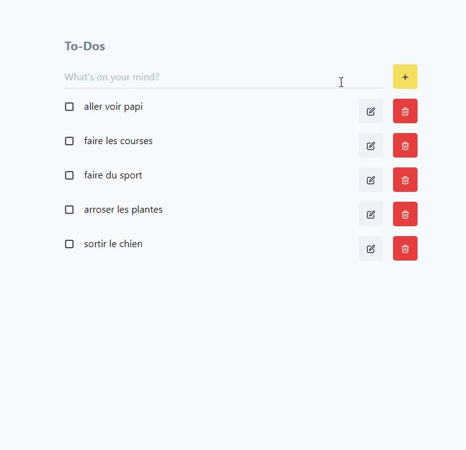

## Demo



## 📦 Installing the project

```
git clone (or download)
cd front-end-test
npm install
```

### Running the project

```
npm run dev
```

Your web-app will be available at [localhost:3000](http://localhost:3000)
